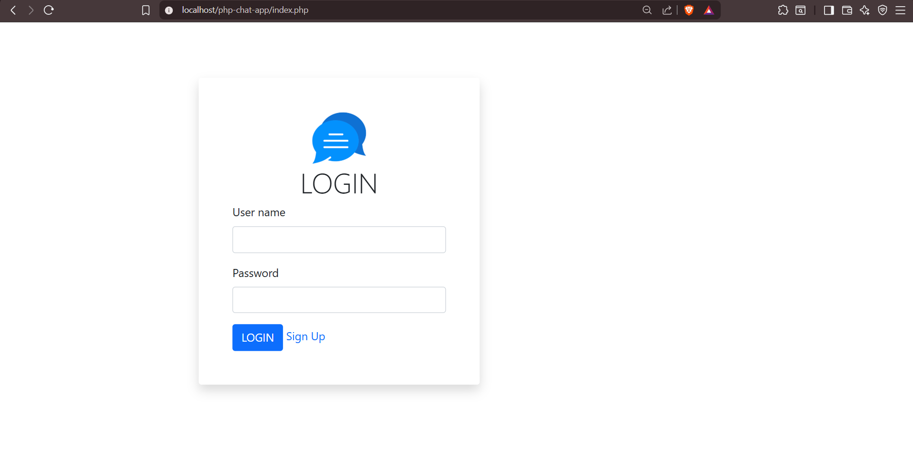
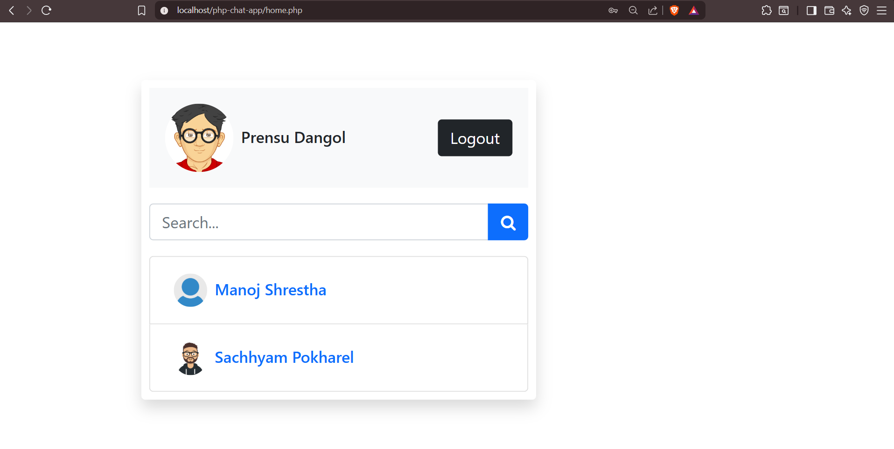
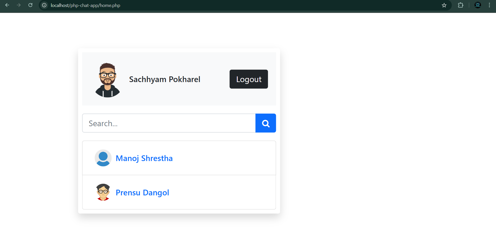

📩 PHP Chat App

A simple and lightweight real-time chat application built using PHP, MySQL, AJAX, and Bootstrap.
This project allows users to sign up, log in, and chat with other registered users in a clean and responsive UI.

🚀 Features

👤 User Authentication (Signup & Login)

💬 Real-time Messaging using AJAX

📸 User Profile Images

🟢 Online / Offline Status

🔒 Secure Password Handling

📱 Responsive UI with Bootstrap

🗄️ MySQL Database for storing users and messages

📂 Project Structure
php-chat-app/
│── app/
│   ├── http/        # Login, Signup, and core backend logic
│   ├── database/    # DB connection
│   ├── helpers/     # Utility functions (if any)
│── assets/
│   ├── css/         # Stylesheets
│   ├── js/          # AJAX scripts
│   ├── images/      # Uploaded user images
│── config/
│   ├── constants.php
│── index.php
│── chat.php
│── signup.php
│── login.php

🛠️ Installation Guide
1️⃣ Clone or Download the Project
git clone https://github.com/your-username/php-chat-app.git

📦 Technologies Used

PHP

MySQL

AJAX

Bootstrap 5

JavaScript

HTML/CSS

🧑‍💻 Author

Prensu Dangol 
